# Usage

Check the file  [u_shapelet.ipynb](./u_shapelet.ipynb) for tutorial.  

Rerun the experiment using the file [run_in_parallel.py](./run_in_parallel.py). 

The datasets: [uncertain-dataset.tar.gz](./uncertain-dataset.tar.gz)

# Results

- The accuracy of each considered method and each uncertainty level is here: [all_results.csv](./all_results.csv)

### Critical difference diagrams of models accuracy rank(lower is better)

|      | Low uncertainty                                              | Medium uncertainty                                           | High uncertainty                                             |
| ---- | ------------------------------------------------------------ | ------------------------------------------------------------ | ------------------------------------------------------------ |
| NB   | 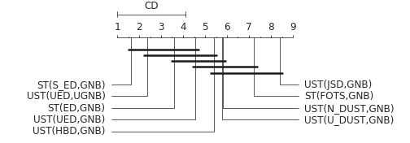 | 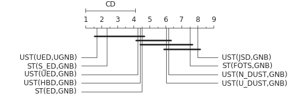 | 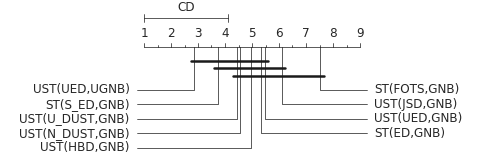 |
| RF   | 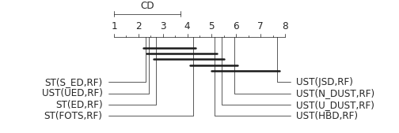 | 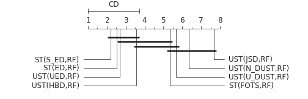 | 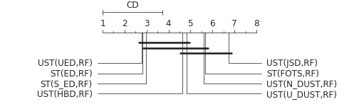 |
| All  | 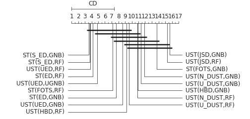 | 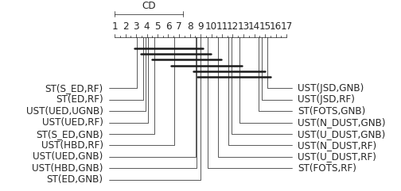 | 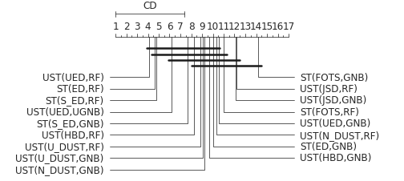 |

### Accuracy scatter plots of UST(UED,RF)  vs others

- Low uncertainty

  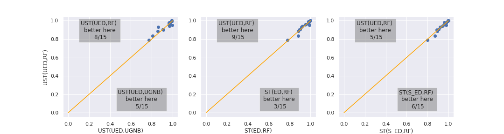

- Medium uncertainty 

  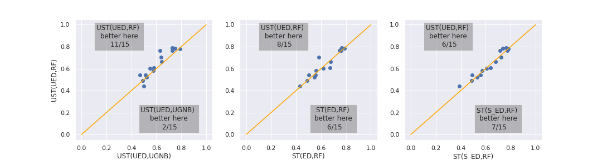

- High uncertainty

  

  

### Critical difference diagrams of models log loss (lower is better)

|      | Low uncertainty                                              | Medium uncertainty                                           | High uncertainty                                             |
| ---- | ------------------------------------------------------------ | ------------------------------------------------------------ | ------------------------------------------------------------ |
| NB   |  |  |  |
| RF   |  |  |  |
| All  | 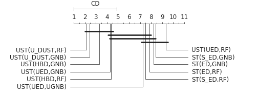      | 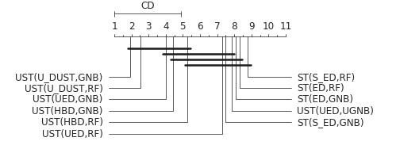      | 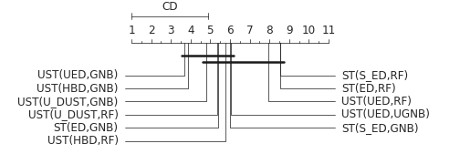      |

# Dependencies

- imbalanced-learn=0.7.0
- numpy==1.19.5
- pandas==1.2.0
- sktime==0.5.1
